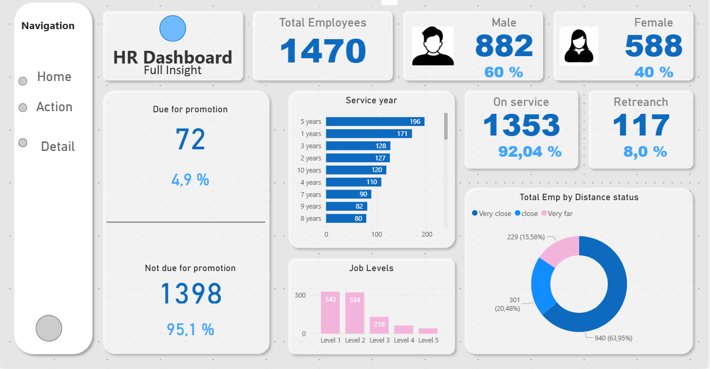
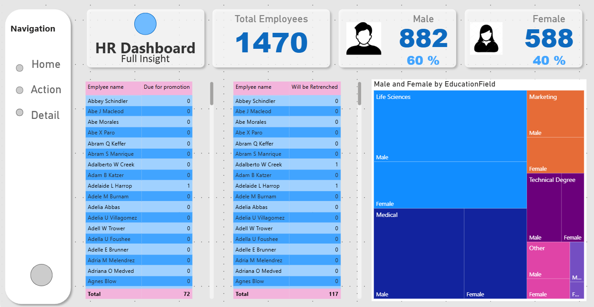
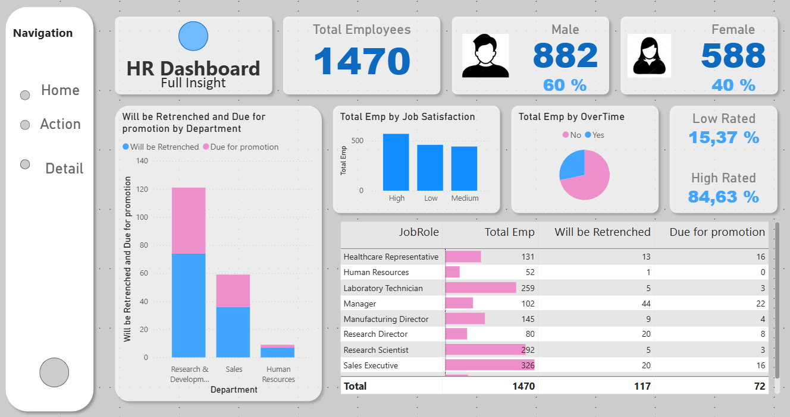

Power BI Dashboard – RH Insights

# Captures du dashboard

*Page Home — 1 470 employés, 92 % en poste, 8 % de départs. 4,9 % de l'effectif éligible à une promotion.*

*Page Action — liste nominative des promotions et des départs, exploitable par les RH.*

*Page Détail — croisement satisfaction, heures supplémentaires et département.*
🇫🇷 Présentation du projet

Ce projet a été réalisé dans le cadre de ma formation en ingénierie des données.
L’objectif est de concevoir un dashboard Power BI interactif pour analyser les indicateurs RH :

total d’employés, répartition par genre, promotion et retranchement, satisfaction, job level

suivi des employés par département, rôle, et distance status

Ce projet m’a permis de combiner analyse de données RH, storytelling et conception visuelle avec Power BI.

🧩 Données & Outils

Source de données : fichiers RH (CSV / Excel)

Outil : Microsoft Power BI

Préparation : Power Query

Mesures : DAX (Total Employees, % Male/Female, % Due for Promotion, etc.)

📈 Structure du Dashboard
🟢 Page 1 — Home

Indicateurs clés :

👥 Total d’employés

⚖️ Répartition Hommes / Femmes avec pourcentage

📊 Job Level : bar chart (Level 1 → Level 5)

📍 Carte : employés en service / retrench avec pourcentage

🔵 Cercle : total d’employés par distance status (Very Close / Close / Very Far)

🚀 Statut promotion : « Due for promotion » et « Not due for promotion » avec pourcentage

🤖 Chatbot de service

🔵 Page 2 — Action

Indicateurs clés :

👥 Total d’employés, nombre d’hommes et de femmes

📋 Tableau 1 : Employee Name due for promotion + total

📋 Tableau 2 : Employee Name will be retrenched + total

🗺️ Tree Map : Male / Female by Education Level

🔴 Page 3 — Détail

Indicateurs clés :

📊 Bar chart : total employees by Job Satisfaction (High / Medium / Low)

📊 Bar chart : total employees by Overtime

⚖️ Employee Rating : Low Rated / High Rated avec pourcentage

📋 Tableau : Job Role, Total Employees, Will be Retrenched, Due for Promotion, Total

📊 Bar chart : Will be Retrenched & Due for Promotion by Department

🧠 Ce que j’ai appris

Créer un dashboard Power BI multi-pages et interactif pour les RH

Utiliser DAX pour calculer KPI et pourcentages clés

Structurer un rapport clair et visuellement attractif

Analyser la performance et le statut des employés par différents indicateurs

📂 Structure du dépôt
/RH_Dashboard
├─ HR.pbix
├─ README.md
├─ data/
│   ├─ employees.csv
│   └─ promotions.csv
└─ assets/
    └─ screenshots/

👩‍💻 Auteur

Arij NJ
Étudiante en ingénierie des données | Data Analyst & Power BI Enthusiast
🔗 [LinkedIn](https://linkedin.com/in/arij-njaimi) | [GitHub](https://github.com/ERIJNJAIMI)

🇬🇧 English Version
🎯 Project Overview

This Power BI project was developed as part of my Data Engineering studies.
Its goal is to design an interactive HR dashboard to analyze:

total employees, gender distribution, promotion & retrenchment, satisfaction, job levels

employee tracking by department, role, and distance status

📊 Dashboard Overview
Page 1 — Home

KPIs: Total Employees, Male/Female distribution, Promotion Status

Job Level: bar chart (Level 1 → Level 5)

Map: Employees by status (Active / Retrenched)

Circle chart: Total employees by Distance Status (Very Close / Close / Very Far)

Service Chatbot

Page 2 — Action

KPIs: Total Employees, number of Males and Females

Table 1: Employee Name due for Promotion + total

Table 2: Employee Name will be Retrenched + total

Tree Map: Male / Female by Education Level

Page 3 — Detail

Bar charts: Total Employees by Job Satisfaction & Overtime

Employee Rating: Low / High Rated with percentage

Table: Job Role, Total Employees, Will be Retrenched, Due for Promotion, Total

Bar chart: Will be Retrenched & Due for Promotion by Department

🧠 Key Learnings

Building multi-page interactive dashboards for HR

Creating DAX measures for key KPIs

Structuring clear and visually attractive reports

Analyzing employee performance and status by multiple indicators

👩‍💻 Author

Arij NJ
Data Engineering Student | Data Analyst & Power BI Enthusiast
🔗 [LinkedIn](https://linkedin.com/in/arij-njaimi) | [GitHub](https://github.com/ERIJNJAIMI)
